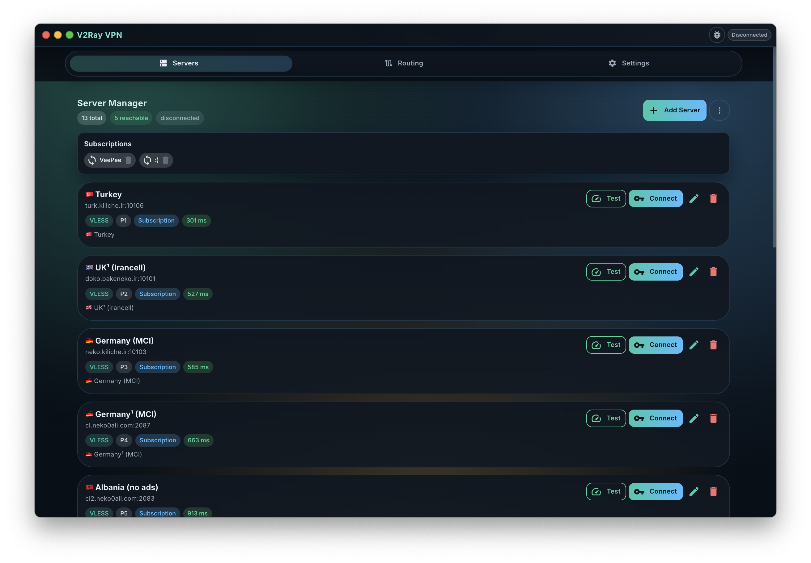

# V2Ray VPN

Desktop V2Ray client (Electron + React).



## What this app does

- Manage V2Ray servers (VLESS, VMess, Trojan, Shadowsocks)
- Connect/disconnect with live traffic stats
- Set proxy mode (Global, Per-app, PAC)
- Manage per-app policies and routing rules
- Run a local relay bridge from the **Bridge** tab (MasterHttpRelayVPN workflow)
- Check/download updates from GitHub Releases

## Requirements

- Node.js 18+
- npm 9+
- Python 3.10+ (for Bridge runtime)
- `v2ray-core/` binaries present
- `bridge-core/` (setup.sh)

## Run locally

```bash
npm install
npm run dev
```

## Build

```bash
npm run build
npm run dist
```

- `npm run build`: renderer + main build
- `npm run dist`: package installers locally (no upload)

## Bridge quick setup

- UI to use [MasterHttpRelayVPN](https://github.com/masterking32/MasterHttpRelayVPN)

1. Open **Bridge** tab in the app.
2. Click **Setup Python + Libs** once.
3. Add one or more **Script ID / Auth Key** pairs.
4. Click **Set AUTH_KEY** and **Copy** to copy `Code.gs`.
5. Deploy your Google Apps Script web app.
6. Paste Script ID/Auth Key back in Bridge profile.
7. (Optional) run **Scan Fastest IPs**.
8. Click **Configure + Start**.

Notes:
- The Bridge tab includes an **Open Upstream Repo** button for MasterHttpRelayVPN docs.
- Bridge CA files are auto-managed in user data (`~/.v2ray-vpn/bridge/ca` by default).
## License

MIT
